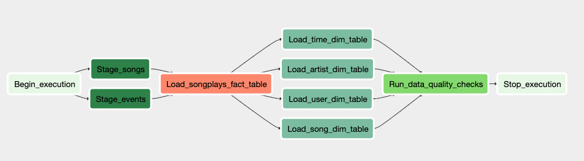
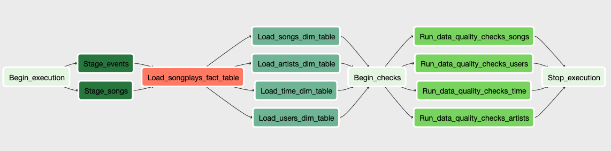

# NDDE5 DataPipeline

This is my fifth project for the Udacity Nanodegree of Data Engineering. It is about an etl process (Redshift and AWS S3 based) for Sparkify carried out via a data pipeline with Apache Airflow.

Sparkify is a simulated (not-real) online music streaming service.

This Git repository shows how to script the data pipeline in Airflow for loading data from json raw data (stored in an AWS S3 bucket), for creating and transfering fact and dimension tables from these files into Amazon Redshift. Basically it is a bit similar to the third NDDE project (see here: https://github.com/ChristophGmeiner/NDDE3_DataWarehouse_AWS)

This is done using Python and SQL.

The focus hereby lies solely on creating the data pipeline and not on the ETL part.

## Purpose of the Database sparkifydb

The sparkifydb is a data warehouse stored in Amazon Redshit and is about storing information about songs and listening behaviour of users.

The analytical goal of this database is to get all kinds of insights into the user beahviour (listenting preferences, highest rated artist, high volume listening times, etc.)

Please be aware that this data is for demonstration purposes only and therefore not very complete i.e. we only see some users and only data for one month, i.e. Nov. 2018.

## Description of the data pipeline

All confidential information needed for connecting to AWS is stored in a local file (not part of this repo), i.e. dl.cfg. See the scripts for details on that.

As a first step, please see the graphic view of the Airflow dag for the data pipeline below:

As one can see in the figure above, it is the same process as in my other NDDE projects. First the json data (one for stongs and another one for log events) is staged into two postgres staging tables. Then the fact able is created out of the stagings tables, After that the dimension tables are built the same way. Finally some quality checks are carried out.

### Data quality checks

I implemented some data checks within a custom Airflow operator. This operator (i.e. DataQualityOperator) always checks whether the record amount of unique or key records macthes between the fact / staging tables and the correspondong dimension tables.

After this adaption the DAG looks like this:

### Details on the data quality checks

## Files and scripts

### /dags/udac_example_dag.py
This is the code for the DAG containing all the workflow components.

### plugins/helpers/__init__.py
Initialisation of helper modules, i.e. SQL queries (see below).

### plugins/helpers/sql_queries.py
SQL statements for inserting data into Redshift tables.

### plugins/helpers/create_tables.py
SQL statements for creating and if necessray dropping Redshift tables.

### plugins/helpers/check_queries.py
SQL statements for doing data quality checks.

### plugins/operators/__init__.py
Initialisation of operator modules(see below).

### plugins/operators/data_quality.py
Operator, which tests whether the number of fact records (concerning a spcific dimension key) matches the corresponding numbers of records in the dimension table.

### plugins/operators/stage_redshift.py
Operator, which stages json data stored in a S3 bucket into a Redshift datawarehouse. See docstring for details.

### plugins/operators/load_fact.py
Operator, which loads data from staging tables into a fact table. See docstring for details.

### plugins/operators/load_dimension.py
Operator, which loads data from staging tables into dimension tables. See docstring for details.

